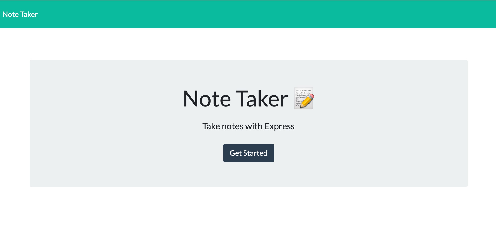

# 📝 Note-Taker
## Description
 This is an application which can be use to jot down reminders.

##  📖 How to Use 
### To add content to the Note-taker app:

```
- Click on the Title and add your chosen title.
- Then add the note or reminder. 
- Then press the save icon in the top right of the application.

```

### To add another note to the Note-taker app:

```
- Click on the + button
- Click on the Title and add your chosen title.
- Then add the note or reminder. 
- Then press the save icon in the top right of the application.

```

### 🛠 To delete content from the Note-taker app:

```
- Click on the Note you wish to delete.
- Then click the Bin icon 

```

## 📷 Screenshots

Here is a screenshot of the Note-Taker


                                                                                             

##  🎞️ Short film


<iframe src="https://youtu.be/3Y340rdGHE8" width="640" height="480"></iframe>

```
---
## Portfolio Project 
This project is the second bootcamp homework to consolidate learning 
in week 2 and can be found at 

```
### 🔗 Links
[](https://abrics.github.io/AbriCS/Note-Taker)

### Author
- [@AbriCS](https://www.github.com/AbriCS)

### Acknowledgements

 - [Awesome Readme Templates](https://awesomeopensource.com/project/elangosundar/awesome-README-templates)
 - [Awesome README](https://github.com/matiassingers/awesome-readme)
 - [Emoji Icons](https://github.com/ikatyang/emoji-cheat-sheet/blob/master/README.md)
